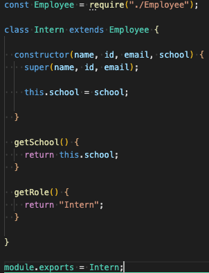

# Team-Generator

## Description
Creating a command-line application that dynamically generates an html file containing a user's team members based from their input using the Inquirer package that is invoked by using the "node index.js" command on the user's local computer's terminal.

## Links
[Github Repository](https://github.com/jkaganovsky/Team-Generator)

## Installation & Usage
1. Clone this repository from my github link.
1. Run your local computer's terminal and git clone this repository to save to your local computer.
1. Install Node.js to your local computer if you don't have it (https://nodejs.org/en/).
1. Run `npm i inquirer` from your computer's terminal to install the **Inquirer** package to the cloned repository's folder.
1. Run `node app.js` on your terminal and answer the questions being asked.
1. When done, your new `team.html` file will be created and saved to the `./Develop/output` folder.

## Content
* DEMO

    

    [HTML Preview Link](https://drive.google.com/file/d/1NUxXeaMoQaHBlKZgxG6sbn_kH2heUSHe/view)

* SCREENSHOTS

    - app.js

    

    

    

    

    

    - employee.js

    

    - engineer.js

    

    - intern.js

    

    - manager.js

    

## Credits
1. My Trilogy Education Tutor, Jacob Carver - https://www.linkedin.com/in/jacob-carver-software-developer125b81191/
1. Information on how and what I can use using Inquirer Package - https://www.npmjs.com/package/inquirer
1. How to use Inquirer.js - https://medium.com/javascript-in-plain-english/how-to-inquirer-js-c10a4e05ef1f

## License
MIT License

Copyright (c) [2020] [Jailanie Kaganovsky]

Permission is hereby granted, free of charge, to any person obtaining a copy
of this software and associated documentation files (the "Software"), to deal
in the Software without restriction, including without limitation the rights
to use, copy, modify, merge, publish, distribute, sublicense, and/or sell
copies of the Software, and to permit persons to whom the Software is
furnished to do so, subject to the following conditions:

The above copyright notice and this permission notice shall be included in all
copies or substantial portions of the Software.

THE SOFTWARE IS PROVIDED "AS IS", WITHOUT WARRANTY OF ANY KIND, EXPRESS OR
IMPLIED, INCLUDING BUT NOT LIMITED TO THE WARRANTIES OF MERCHANTABILITY,
FITNESS FOR A PARTICULAR PURPOSE AND NONINFRINGEMENT. IN NO EVENT SHALL THE
AUTHORS OR COPYRIGHT HOLDERS BE LIABLE FOR ANY CLAIM, DAMAGES OR OTHER
LIABILITY, WHETHER IN AN ACTION OF CONTRACT, TORT OR OTHERWISE, ARISING FROM,
OUT OF OR IN CONNECTION WITH THE SOFTWARE OR THE USE OR OTHER DEALINGS IN THE
SOFTWARE.
